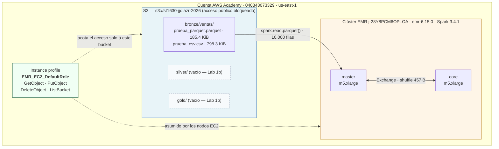

# Arquitectura — Lab 1a

**Curso:** ST1630-2026-2 · **Semana:** S4-S5 · **Fecha de ejecución:** 2026-08-13

**Estudiante:** Juan José Díaz Rodríguez — jjdiazr@eafit.edu.co

**Estudiante:** Juan Simón Ospina Martínez — jsospinam@eafit.edu.co

**Estudiante:** Sebastián Durán Fernández — sduranf@eafit.edu.co

**Estudiante:** Daniel Arcila Salazar — darcilas1@eafit.edu.co

## 1. Diagrama de la arquitectura

> **Nota sobre el rol IAM.** El diagrama muestra `EMR_EC2_DefaultRole` porque es el
> instance profile con el que realmente arrancó el clúster: el sandbox de AWS
> Academy deniega `iam:CreateRole`, así que no pude crear `EMR_EC2_jjdiazr_role`.
> Los cuatro permisos listados son los de la política de mínimo privilegio que
> diseñé y verifiqué (sección 3); el rol por defecto del entorno es más amplio.
> Sin esa restricción, la caja diría `EMR_EC2_jjdiazr_role` con exactamente esos
> cuatro permisos y ninguno más.

## 2. Decisiones de S3

| Decisión | Tu elección | Justificación |
|---|---|---|
| Nombre del bucket | `st1630-jjdiazr-2026` | Los nombres de bucket son únicos a nivel global, así que incluí curso, usuario y cohorte. Con esa convención los cuatro integrantes del fork trabajamos en la misma cuenta sin colisionar, y el dueño de cada recurso se identifica con solo leer el nombre. |
| Región | `us-east-1` | Es la región donde vive la cuenta del sandbox de AWS Academy. Además es la más barata para S3 y EMR, y la única que no exige `LocationConstraint` explícito al crear el bucket. |
| Estructura de prefijos | `bronze/`, `silver/`, `gold/` | Arquitectura medallion vista en S4: una capa por estado del dato, con los datos crudos en `bronze/ventas/`. |

**Justificación del particionamiento** (3-5 líneas): ¿por qué esa
estructura de prefijos y no otra? ¿Consideraste particionar además por
fecha o región dentro de cada capa?

> Separé por **estado del dato**, no por origen ni por área de negocio: `bronze/`
> guarda la ingesta cruda tal como llegó, `silver/` el resultado de la limpieza y
> `gold/` los datos ya agregados y listos para consumo. La razón principal es que
> `bronze/` funciona como respaldo: si una transformación sale mal, reproceso desde
> el original en lugar de volver a pedirle los datos a la fuente, que puede ya no
> tenerlos. Cada capa además tiene un consumidor distinto, y quien necesita el
> resumen de `gold/` no debería pagar el costo de leer 10.000 filas crudas.
>
> **Sí consideré particionar por fecha y por región, y decidí no hacerlo todavía.**
> Mi Parquet pesa 185 KB: particionar por región (5 valores) daría archivos de
> ~37 KB, y por fecha (365 días distintos) archivos de ~500 bytes. Spark rinde con
> archivos de 128 MB a 1 GB, y por cada archivo paga un costo fijo de abrir la
> conexión a S3, leer metadatos y agendar una tarea; con archivos de 500 bytes ese
> costo fijo supera con creces el ahorro de leer menos datos — es el problema de los
> *small files*. Cuando el volumen crezca lo suficiente para que cada partición sea
> un archivo de tamaño razonable, particionaría **primero por `region`**, que es mi
> filtro más frecuente, y **luego por `fecha`**, que consulto de forma más puntual
> (rangos históricos concretos, no un barrido continuo).

## 3. Decisiones de IAM

- ¿Qué permisos otorgaste al rol de EMR, exactamente?

  → Cuatro acciones, repartidas en dos statements porque actúan sobre recursos
  distintos (ver [`politica-min-privilegio.json`](politica-min-privilegio.json)):

  | Statement | Acciones | Recurso |
  |---|---|---|
  | `AccesoObjetosBucketPropio` | `s3:GetObject`, `s3:PutObject`, `s3:DeleteObject` | `arn:aws:s3:::st1630-jjdiazr-2026/*` |
  | `ListarBucketPropio` | `s3:ListBucket` | `arn:aws:s3:::st1630-jjdiazr-2026` |

  `ListBucket` va aparte porque se evalúa sobre el bucket como recurso, no sobre
  los objetos dentro de él: por eso su ARN no lleva `/*`. Ese detalle es fácil de
  pasar por alto y es la causa típica de un `AccessDenied` al listar un prefijo
  aunque la lectura de objetos sí funcione.

  **Limitación del entorno:** el sandbox de AWS Academy (rol `voclabs`) deniega
  `iam:CreateRole`, así que no fue posible adjuntar esta política a un rol propio
  ni crear `EMR_EC2_jjdiazr_role`. La verifiqué con `iam:SimulateCustomPolicy`, que
  evalúa un documento de política sin necesidad de adjuntarlo a un principal
  existente — evidencia completa en [`simulacion-iam.md`](simulacion-iam.md). El
  clúster tuvo que arrancar con `EMR_EC2_DefaultRole`, el instance profile
  pre-creado del entorno, que es más permisivo que mi política. Es una restricción
  impuesta, no una decisión de diseño.

- ¿Qué permisos consideraste y descartaste? ¿Por qué?

  → Descarté cuatro, y el criterio fue el mismo en todos: **Spark solo lee un
  Parquet de `bronze/` y escribiría los resultados en `silver/`. Nada más.**

  | Descartado | Por qué |
  |---|---|
  | `s3:DeleteBucket` | Un job de Spark nunca necesita destruir el bucket que está leyendo. Concedérselo solo abre la puerta a que un error lo haga. |
  | `s3:PutBucketPolicy` | Permitiría al clúster reescribir quién accede al bucket — incluso abrirlo a internet. Es una acción de administración, no de procesamiento. |
  | `s3:*` sobre `Resource: "*"` | Es la opción que el propio `setup_iam.sh` marca como "NO USAR". Cubre todas las acciones sobre todos los buckets de la cuenta. |
  | Acceso a los buckets de mis compañeros | Ninguna consulta mía toca `st1630-darcilas1-2026` ni los demás. Compartimos cuenta AWS, así que este es el riesgo más concreto de todos. |

  Lo que cambia si los otorgo "por si acaso" no es lo que el clúster *hace*, sino
  lo que puede llegar a hacer cuando algo sale mal: un bug en un job, o las
  credenciales del nodo filtradas, pasan de poder afectar mis 185 KB de datos a
  poder borrar el trabajo de los otros tres integrantes del equipo. El permiso no
  usado no es neutro: es radio de daño esperando una falla.

  Viví este mismo principio desde el otro lado. El sandbox no me dejó crear roles
  IAM, y al principio lo leí como un obstáculo. Es exactamente la misma decisión que
  yo tomé con mi clúster: AWS Academy le da a cada estudiante lo mínimo para
  trabajar, porque compartimos infraestructura y un permiso de más en mi cuenta es
  un riesgo para el resto.

- ¿Por qué importa el mínimo privilegio específicamente en un sistema
  **distribuido** como este (no solo "es buena práctica")? Conecta con
  el Teorema CAP: un agente/rol con acceso excesivo es, en cierto
  sentido, un riesgo análogo al de un nodo que retorna datos
  inconsistentes — ambos rompen una garantía que el resto del sistema
  asume que se sostiene.

  → Porque en un sistema distribuido **el daño cruza la frontera de quien puede
  repararlo**. Si mi nodo devuelve datos desactualizados, el problema es mío: yo lo
  detecto y yo lo corrijo. Pero si mi nodo tiene permiso para escribir en el bucket
  de un compañero y un job con un bug lo usa, el problema aparece en su lado — y él
  no puede arreglarlo solo, porque la causa está en un sistema que no controla ni
  ve. Detección y reparación quedan separadas del origen.

  Ahí está el paralelo con CAP. La consistencia es una garantía que cada nodo
  sostiene y los demás **asumen sin verificar**: nadie revisa si el dato que le
  llegó es el más reciente, se confía en que el protocolo lo asegura. El
  aislamiento entre recursos funciona igual: nadie revisa, en cada escritura, si
  quien la hizo tenía derecho — se confía en que IAM lo acotó de antemano. En ambos
  casos la garantía es invisible mientras se cumple y solo se nota cuando ya se
  rompió, normalmente lejos del punto donde se originó.

  Y en un clúster el efecto se multiplica: no es una máquina con un permiso de más,
  son N nodos cargando el mismo exceso, cada uno capaz de ejercerlo por su cuenta.
  Por eso acotar el `Resource` al propio bucket no es formalismo: es lo que mantiene
  el radio de daño dentro de los límites de quien puede responder por él.

## 4. Decisiones de EMR

- Tipo de instancia elegido y justificación (¿por qué es "mínimo
  viable" para este ejercicio, y qué cambiarías para producción?):

  → **2 × `m5.xlarge`** (1 master + 1 core), 4 vCPU y 16 GB de RAM cada una.

  "Mínimo viable" aquí no se refiere al rendimiento sino al **comportamiento**: con
  un solo nodo Spark corre en modo local, un único proceso que no reparte trabajo.
  Con 10.000 filas eso incluso sería más rápido. Pero entonces no habría `Exchange`
  en el plan, y el `Exchange` es justo lo que hay que demostrar — es el momento en
  que Spark mueve datos entre máquinas para agrupar por producto. En mi captura del
  DAG aparece con `shuffle bytes written: 457 B` y `number of partitions: 1000`:
  esos 457 bytes viajaron por la red entre nodos. Con un nodo, esa caja no existe.
  Los 2 nodos no compran velocidad, compran **la posibilidad de observar el
  comportamiento distribuido**.

  Para producción cambiaría tres cosas, ninguna relacionada con el tipo de
  instancia en sí:
  1. **Varios core nodes con autoescalado**, dimensionados según el volumen real —
     no un número fijo elegido a mano.
  2. **Instancias spot** para los core nodes (el master en on-demand): mismo trabajo
     a una fracción del precio, aceptando que un nodo pueda desaparecer, que es
     precisamente lo que Spark sabe tolerar.
  3. **Clúster efímero por job** en lugar de uno encendido esperando trabajo. Este
     lab lo deja claro: el clúster costó ~$0.25 en 28 minutos, pero encendido 24/7
     un mes serían ~$346. Lo que define el costo no es el tamaño, es el tiempo
     prendido.

- Configuración de Spark/aplicaciones instaladas:

  → **EMR 6.15.0** con **Spark 3.4.1** y **Hadoop**, sobre Amazon Linux 2. Un
  bootstrap action instaló `pandas` y `pyarrow` en cada nodo antes de arrancar
  Spark, para poder manipular los datos con esas librerías si hiciera falta.

  No modifiqué la configuración de Spark por defecto de EMR: viene con
  `spark.master=yarn`, así que la sesión creada con `SparkSession.builder` se
  registra automáticamente en YARN y reparte el trabajo entre los nodos. Lo
  confirma el aviso `WARN Client: Neither spark.yarn.jars nor spark.yarn.archive is
  set` en la salida del notebook — un mensaje que solo aparece cuando el job va a
  YARN, no en modo local.

  El notebook se ejecutó **en el nodo master** con `jupyter nbconvert --execute`,
  exportando `SPARK_HOME=/usr/lib/spark` y el `PYTHONPATH` de py4j, para que el
  kernel usara el Spark del clúster y no una instalación local.

## 5. Estimación de costo

Precios de lista de `us-east-1`, verificados en [calculator.aws](https://calculator.aws/):

| Componente | Tarifa | Costo/hora |
|---|---|---|
| 2 × EC2 `m5.xlarge` on-demand | $0.192 c/u | $0.384 |
| Recargo del servicio EMR | $0.048 c/u | $0.096 |
| EBS 64 GB gp2 × 2 | ~$12.80/mes | ~$0.018 |
| **Total cómputo** | | **~$0.498/h** |

| Escenario | Costo estimado |
|---|---|
| Clúster encendido 24/7 durante un mes | $0.498 × 24 × 30 = **~$358** |
| Clúster encendido solo lo que lo usé (28 min: 10:52–11:20) | 0.47 h × $0.498 = **~$0.23** |
| Almacenamiento S3 (984 KiB + ~300 peticiones) | **< $0.01/mes** |

**Diferencia: ~1.500x** entre los dos escenarios, con exactamente la misma
infraestructura. Los USD 50 de crédito del semestre se agotarían en **4 días** con
el clúster olvidado encendido; con el patrón de uso real de este lab darían para
unas 100 sesiones.

Lo que más me llamó la atención del desglose: el almacenamiento es despreciable
(menos de un centavo al mes por el mismo dato que el clúster procesa en segundos).
Todo el costo está en el cómputo, y el cómputo se cobra por tiempo encendido, no
por trabajo hecho — mi clúster estuvo ~8 minutos arrancando y ~5 minutos ejecutando
algo, pero pagué los 28 completos.

> El consumo real no pude contrastarlo: el sandbox de AWS Academy de este curso no
> expone un contador de presupuesto, y `ce:GetCostAndUsage` no está disponible para
> el rol `voclabs`. Las cifras de arriba son estimaciones con precio de lista.

## 6. Reflexión — la era agéntica

¿En qué decisión de este lab dudaste más? ¿Qué le consultaste a un
agente de IA y qué terminaste decidiendo por tu cuenta?

> Donde más dudé fue cuando `setup_iam.sh` falló con `AccessDenied` en
> `iam:CreateRole`. Lo primero que pensé fue que el script no servía en Windows —
> minutos antes había fallado de verdad por eso, porque `aws.exe` no entiende las
> rutas `/tmp` de Git Bash, y me quedé con esa explicación. Pero el mensaje decía
> otra cosa: no era mi máquina, era AWS negándole el permiso a mi usuario. Me llevé
> de ahí que un error anterior te condiciona a leer mal el siguiente, y que el
> mensaje casi siempre dice exactamente qué pasó si uno lo lee en vez de asumir.
>
> La decisión de fondo vino después: el entorno bloqueaba justo la parte central
> del lab. Podía buscar cómo saltarme la restricción para que "funcionara igual"
> —usar `LabRole`, o una política amplia que sí me dejaran aplicar— o aceptarla y
> demostrar el razonamiento por otra vía. Elegí lo segundo. Al agente le consulté
> **cómo** verificar una política sin poder adjuntarla a un rol, y de ahí salió
> `iam:SimulateCustomPolicy`, que yo no conocía. Lo que decidí por mi cuenta fue
> **qué** verificar: las seis pruebas de `simulacion-iam.md` incluyen el bucket de
> un compañero y el borrado de mi propio bucket, porque lo que quería demostrar no
> era que la política sirviera, sino que **no alcanzara para nada más**.
>
> Algo parecido pasó con el benchmark: me dio 0.51x cuando en clase vimos ~9x a
> favor de Parquet. Preferí dejar el número real y explicar la causa antes que
> repetirlo hasta que diera "bonito".

## 7. Bitácora de delegación

Agente usado: **Claude Code (Opus 5)**, en sesión guiada del 2026-08-12 al 2026-08-13.

| Tarea | ¿Delegado a agente? | Justificación |
|---|---|---|
| Instalación de AWS CLI y configuración de credenciales del sandbox | **Parcial** | El agente dictó los comandos, yo los ejecuté. Troubleshooting de entorno, sin valor de aprendizaje según `politica-ia.md`. |
| Edición de las variables de los tres scripts (`ESTUDIANTE`, `KEY_NAME`, `SUBNET_ID`) | **No** | Las hice a mano. Requieren entender qué recurso nombra cada variable y que coincidan entre scripts. |
| Ejecución de `setup_s3.sh`, `create_emr.sh` y creación del key pair | **No** | Ejecutados por mí en mi terminal contra mi cuenta. |
| Corrección de tres bugs de los scripts del repo | **Sí** | El agente los detectó revisando el lab: (1) rutas `/tmp` de Git Bash que `aws.exe` no resuelve en Windows, (2) `--use-default-roles` duplicando el `InstanceProfile` con el de `--ec2-attributes`, (3) etiqueta incorrecta en la segunda simulación de `setup_iam.sh`. Es troubleshooting, explícitamente delegable en la rúbrica de este lab. |
| Contenido de la política de mínimo privilegio | **Parcial** | Las cuatro acciones vienen del propio `setup_iam.sh` del repo. Lo que decidí yo fue qué permisos **descartar** y por qué (sección 3). |
| Diseño del plan B tras el bloqueo de `iam:CreateRole` | **Sí** | El agente propuso verificar con `iam:SimulateCustomPolicy` en vez de crear el rol, y armó la matriz de 6 pruebas de `simulacion-iam.md`. Yo no conocía ese comando. |
| Ejecución del notebook en el clúster (`nbconvert` + `SPARK_HOME`/`PYTHONPATH`) | **Sí** | El agente definió el método para ejecutarlo contra YARN; yo corrí los comandos en el nodo master. |
| Captura del DAG en Spark UI | **No** | Túnel SSH, navegación por Spark History Server y captura hechas por mí. |
| Estructura de prefijos y decisión de no particionar | **No** | Razonamiento propio (separación por estado del dato, `bronze/` como respaldo). El agente aportó el dato técnico del umbral de tamaño de archivo en Spark; la conclusión de no particionar hoy la saqué yo. |
| Argumento de mínimo privilegio en sistemas distribuidos (sección 3) | **No** | La idea de que el daño cruza la frontera de quien puede repararlo es mía, planteada en conversación antes de escribirla. |
| Justificación de los 2 nodos EMR (sección 4) | **No** | Propia: sin un segundo nodo no hay `Exchange`, y lo que se demuestra es comportamiento distribuido, no rendimiento. |
| **Redacción de las secciones 1 a 5 de este documento** | **Sí** | El agente redactó el texto final a partir de mis respuestas en conversación. El razonamiento es mío; la prosa, el formato de las tablas y el diagrama Mermaid son suyos. `politica-ia.md` permite delegar redacción y diagramas a partir de un diseño propio. |
| Cálculo de la estimación de costos (sección 5) | **Sí** | Aritmética sobre precios de lista de `us-east-1`. |
| Reflexión de la sección 6 | **No** | Experiencia propia. |

> Recuerda: los permisos IAM, la estructura de prefijos, las
> justificaciones de este documento y la interpretación de los
> resultados de Spark deben reflejar tu propio criterio (ver
> `../../../docs/politica-ia.md`).
