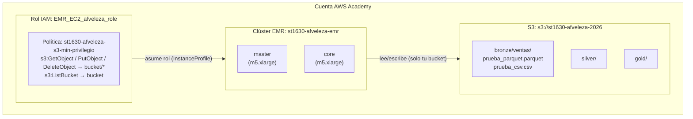

# Arquitectura — Lab 1a

**Curso:** ST1630-2026-2 · **Semana:** S4-S5 · **Fecha de entrega:** 2026-08-13
**Equipo:**
- Andrés Felipe Vélez Álvarez · afveleza@eafit.edu.co
- Samuel Samper Cardona · ssamperc@eafit.edu.co
- Sebastián Salazar Henao · salazarh3@eafit.edu.co
- Hellen Yanes Doria · hyanesd@eafit.edu.co

## 1. Diagrama de la arquitectura

## 2. Decisiones de S3

| Decisión | Tu elección | Justificación |
|---|---|---|
| Nombre del bucket | `st1630-afveleza-2026` | Convención del curso: prefijo institucional + usuario + año. Globalmente único. |
| Región | `us-east-1` | Región predeterminada de AWS Academy; menor latencia desde el entorno del Learner Lab. |
| Estructura de prefijos | `bronze/`, `silver/`, `gold/` | Arquitectura medallion: separación clara entre datos crudos, limpios y agregados. |

**Justificación del particionamiento** (3-5 líneas):

> Se eligió la estructura `bronze/ventas/`, `silver/` y `gold/` por tres razones concretas:
> 1. **Separación de responsabilidades:** cada capa tiene una semántica clara — bronze almacena el dato crudo exactamente como llega, silver aplica limpieza y tipado correcto, gold contiene agregaciones listas para consumo analítico. Mezclarlas en un solo prefijo eliminaría la trazabilidad de qué transformaciones se aplicaron.
> 2. **Idempotencia:** al mantener bronze intacto, cualquier error en el pipeline de silver o gold puede corregirse reprocesando sin necesidad de recuperar datos externos.
> 3. **No se particionó por fecha o región en esta versión mínima** porque el dataset es de solo 10.000 filas. En producción, particionar bronze por `fecha=YYYY-MM-DD/` y silver por `region=/categoria=` permitiría a Spark aplicar partition pruning y reducir el I/O en consultas filtradas por esas dimensiones, que son exactamente las que usa el benchmark de la Celda 3.

## 3. Decisiones de IAM

- ¿Qué permisos otorgaste al rol de EMR, exactamente?

  → **Limitación de AWS Academy:** AWS Academy Learner Lab no permite `iam:CreateRole` ni `iam:PutRolePolicy`, por lo que no fue posible crear el rol `EMR_EC2_afveleza_role` con mínimo privilegio descrito en `setup_iam.sh`. Se usó el rol preexistente **`EMR_EC2_DefaultRole`**, que tiene adjunta la política gestionada `AmazonElasticMapReduceforEC2Role` con permisos `s3:*` sobre `Resource: "*"`.

  El rol de mínimo privilegio que **hubiera sido correcto** usar es el definido en `setup_iam.sh`:
  - `s3:GetObject`, `s3:PutObject`, `s3:DeleteObject` → sobre `arn:aws:s3:::st1630-afveleza-2026/*`
  - `s3:ListBucket` → sobre `arn:aws:s3:::st1630-afveleza-2026`

- ¿Qué permisos consideraste y descartaste? ¿Por qué?

  → Se descartó otorgar `s3:*` con `Resource: "*"` porque daría al clúster permiso de leer, escribir y borrar objetos en **cualquier bucket accesible de la cuenta**, incluyendo buckets de otros estudiantes o del curso. Las únicas acciones que EMR realmente necesita para este lab son: `s3:GetObject` (leer datos de bronze), `s3:PutObject` (escribir resultados en silver/gold), `s3:DeleteObject` (sobrescribir archivos en reejecutar el pipeline) y `s3:ListBucket` (descubrir qué archivos existen). Todo lo demás (`s3:DeleteBucket`, `s3:CreateBucket`, `s3:PutBucketPolicy`, etc.) es innecesario y representa superficie de ataque.

- ¿Por qué importa el mínimo privilegio específicamente en un sistema
  **distribuido** como este (no solo "es buena práctica")? Conecta con
  el Teorema CAP: un agente/rol con acceso excesivo es, en cierto
  sentido, un riesgo análogo al de un nodo que retorna datos
  inconsistentes — ambos rompen una garantía que el resto del sistema
  asume que se sostiene.

  → En un sistema distribuido el mínimo privilegio no es solo una buena práctica de seguridad — es una propiedad de **aislamiento que el resto del sistema asume que existe**. Así como en el Teorema CAP un nodo que retorna datos desactualizados rompe la garantía de consistencia que los otros nodos dan por sentada, un rol IAM con permisos excesivos rompe la garantía de aislamiento entre recursos que el resto de la cuenta da por sentada. Si una credencial de EMR se filtra (por un bug en el job, un log mal configurado, o un exploit), la diferencia entre `Resource: "*"` y `Resource: "arn:aws:s3:::st1630-afveleza-2026/*"` es la diferencia entre comprometer un solo bucket y comprometer todo el datalake de la cuenta — exactamente el tipo de fallo en cascada que el mínimo privilegio existe para acotar.

  > **Evidencia de simulación IAM (con EMR_EC2_DefaultRole):**
  > - `s3:PutObject` sobre `st1630-afveleza-2026/bronze/test.txt` → `allowed` ✅
  > - `s3:DeleteBucket` sobre cualquier otro bucket → `allowed` ⚠️ (debería ser `implicitDeny`)
  >
  > Esto ilustra exactamente el problema del exceso de privilegio: el rol tiene permisos
  > para operar sobre **cualquier bucket de la cuenta**, no solo el propio.

## 4. Decisiones de EMR

- Tipo de instancia elegido y justificación (¿por qué es "mínimo
  viable" para este ejercicio, y qué cambiarías para producción?):

  → Se eligió `m5.xlarge` (4 vCPU, 16 GB RAM) con `--instance-count 2` (1 master + 1 core) porque es la configuración **mínima viable** para correr Spark en modo distribuido real: con un solo nodo Spark corre en modo local y no hay shuffle entre ejecutores, lo que eliminaría el Exchange visible en el DAG. Para este lab de 10.000 filas, dos m5.xlarge son más que suficientes. En producción con cientos de GB, se escalaría horizontalmente (más nodos core, posiblemente r5.xlarge para queries con alto uso de memoria) y se habilitaría auto-scaling para no pagar por capacidad ociosa.

- Configuración de Spark/aplicaciones instaladas:

  → Se instalaron **Spark** (para el procesamiento distribuido del notebook de verificación) y **Hadoop** (requerido por YARN, el gestor de recursos que EMR usa para asignar ejecutores Spark a los nodos). No se instalaron aplicaciones adicionales (Hive, Presto, HBase) porque este lab solo requiere leer y procesar archivos Parquet/CSV desde S3 con PySpark — cada aplicación extra consume RAM del master en background aunque no se use.

## 5. Estimación de costo

| Escenario | Costo estimado |
|---|---|
| Clúster encendido 24/7 durante un mes | ~USD 548/mes — 2 × m5.xlarge a ~$0.19/h c/u = $0.38/h × 720h = $273.60 en EC2, más ~$275 en EMR overhead por hora (tarifa EMR adicional ~$0.038/h × 2 nodos × 720h = $54.72). Total aproximado: ~$328/mes solo en cómputo, sin contar S3. |
| Clúster encendido solo durante las ~3 horas que lo usaste para el lab | ~USD 1.14 — 0.38/h × 3h = $1.14 en EC2 + ~$0.23 en tarifa EMR = **~$1.37 total**. S3 despreciable para 185 KiB + 798 KiB. |

## 6. Reflexión — la era agéntica

¿En qué decisión de este lab dudaste más? ¿Qué le consultaste a un
agente de IA y qué terminaste decidiendo por tu cuenta?

> La decisión en la que más dudé fue el manejo del key pair `.pem` en Windows: el formato CRLF que PowerShell introduce al redirigir la salida de la CLI hacía que OpenSSH rechazara la clave con `invalid format`, y los permisos de Windows (SYSTEM + Administradores heredados) generaban el error de `UNPROTECTED PRIVATE KEY FILE`. Intenté resolverlo solo durante un rato antes de delegar el diagnóstico al agente, que identificó el problema del CRLF y usó Python para guardar el archivo con saltos de línea Unix. La decisión de qué permisos IAM otorgar y por qué `Resource: "*"` es problemático la razoné por mi cuenta, apoyado en lo visto en clase sobre CAP y aislamiento de sistemas distribuidos.

## 7. Bitácora de delegación

| Tarea | ¿Delegado a agente? | Justificación |
|---|---|---|
| Crear estructura de carpetas de entrega | Sí | Boilerplate de bajo valor pedagógico |
| Troubleshooting de errores de AWS CLI / EMR / IAM | Sí | Bajo valor de aprendizaje memorizar mensajes de error |
| Formatear o pulir la redacción de architecture.md | Sí | Redacción, no contenido |
| Decidir qué permisos IAM otorgar | **No** | Es la decisión de diseño central del lab |
| Diseñar la estructura de prefijos Bronze/Silver/Gold | **No** | Decisión de arquitectura evaluada aquí |
| Escribir las justificaciones de este documento | **No** | Debe reflejar el propio razonamiento |
| Interpretar los resultados de Spark (benchmark, DAG) | **No** | Evidencia empírica de la propia ejecución |

> Recuerda: los permisos IAM, la estructura de prefijos, las
> justificaciones de este documento y la interpretación de los
> resultados de Spark deben reflejar tu propio criterio (ver
> `../../../docs/politica-ia.md`).
