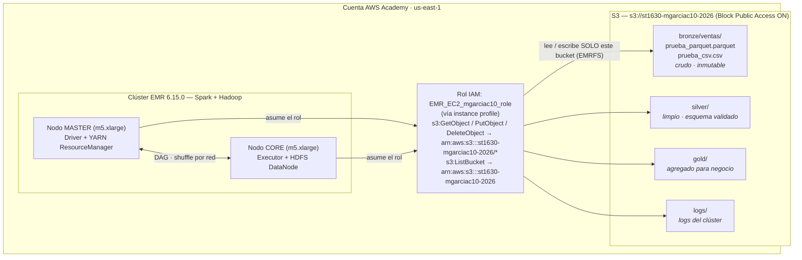

# Arquitectura — Lab 1a

**Curso:** ST1630-2026-2 · **Semana:** S4-S5 · **Fecha de entrega:** _13/08/2026_  
**Estudiantes:**  
 _Mateo García Carreño / mgarciac10@eafit.edu.co_  
 _Juan José Gomez / jjgomezv2@eafit.edu.co_  
 _Juan José Vargas / jjvargasl@eafit.edu.co_  
 _Luis Moreno Gutierrez_

## 1. Diagrama de la arquitectura

Pega tu diagrama (bloque \`\`\`mermaid o ASCII) mostrando: bucket S3 con
las 3 capas, el rol IAM, y el clúster EMR leyendo desde S3.

## 2. Decisiones de S3

| Decisión | Tu elección | Justificación |
|---|---|---|
| Nombre del bucket | `st1630-mgarciac10-2026` | El namespace de S3 es **global**, no por cuenta: el nombre debe ser único en todo el mundo. Se usa el patrón `{curso}-{usuario institucional}-{año}` porque combina un prefijo poco común con un identificador. Todo en minúsculas y con guiones porque S3 no admite mayúsculas ni guiones bajos en nombres de bucket. |
| Región | `us-east-1` | (a) Es la región donde opera el Learner Lab de AWS Academy — otras regiones están restringidas. (b) Colocación de datos y cómputo: el clúster EMR vive en la misma región, así que las lecturas de Spark no pagan transferencia de datos entre regiones ni la latencia extra. |
| Estructura de prefijos | `bronze/`, `silver/`, `gold/` (+ `logs/`), con los datos crudos en `bronze/ventas/` | Es la **arquitectura medallion** llevada al namespace del bucket: el prefijo de primer nivel codifica el *estado de procesamiento* del dato, y el de segundo nivel el *dominio de negocio* (`ventas`). `logs/` se separa al mismo nivel porque es un artefacto operativo del clúster, no un dato del lake, y no debe mezclarse con las capas de datos. |

**Justificación del particionamiento** (3-5 líneas): ¿por qué esa
estructura de prefijos y no otra? ¿Consideraste particionar además por
fecha o región dentro de cada capa?

> S3 no tiene directorios reales: el "prefijo" es solo parte de la
> llave del objeto, pero es la unidad con la que se filtra en un
> `ListBucket` y con la que Spark descubre particiones. Elegimos que el
> primer nivel sea la **capa** (bronze/silver/gold) y no el dominio
> porque la capa es lo que determina las garantías del dato (crudo
> inmutable vs. limpio vs. agregado), y eso es también lo que se quiere
> poder aislar con permisos IAM distintos más adelante: es mucho más
> fácil escribir una política sobre `bronze/*` que sobre
> `ventas/bronze/*` repetido por cada dominio.
>
> Sí consideramos particionar además por fecha dentro de cada capa
> (`bronze/ventas/anio=2026/mes=08/dia=13/`, estilo Hive) y lo
> descartamos para este lab. La ventaja sería *partition pruning*:
> Spark lee solo los directorios que satisfacen el filtro del `WHERE`,
> que es la versión "a nivel de archivo" del predicate pushdown que
> Parquet hace a nivel de row group. Pero con 10.000 filas (< 1 MB) el
> particionamiento por fecha produce decenas de archivos diminutos: el
> clásico problema de small files, donde el overhead de abrir cada
> archivo y de scheduling de tareas supera lo que se ahorra
> leyendo menos datos.

## 3. Decisiones de IAM

- ¿Qué permisos otorgaste al rol de EMR, exactamente?

  
**Diseñado** (`setup_iam.sh`): rol `EMR_EC2_mgarciac10_role` con
  dos statements y nada más:
  - `s3:GetObject`, `s3:PutObject`, `s3:DeleteObject` sobre
    `arn:aws:s3:::st1630-mgarciac10-2026/*` (acciones de **objeto**,
    por eso el `/*`).
  - `s3:ListBucket` sobre `arn:aws:s3:::st1630-mgarciac10-2026`, sin
    `/*`: es acción de **bucket**, y ponerle `/*` hace que la
    simulación dé `implicitDeny` y Spark falle al listar.
  **Implementado:** el script falló con `AccessDenied` sobre
  `iam:CreateRole` — el Learner Lab solo permite roles preexistentes.
  El clúster se creó con `--use-default-roles` (`LabRole`), que es
  bastante más permisivo: puede tocar cualquier bucket de la cuenta.
  Por lo mismo no se pudo correr `simulate-principal-policy`; la
  segunda simulación habría dado `allowed` en vez de `implicitDeny`.
  Es una limitación del entorno, no una decisión de diseño: **el lab
  quedó corriendo con más privilegio del que necesita.**

- ¿Qué permisos consideraste y descartaste? ¿Por qué?

 - `"Action": "s3:*"` con `"Resource": "*"` (o su equivalente
    `AmazonS3FullAccess`): da borrado sobre cualquier bucket de la
    cuenta. Un `overwrite` con el path mal escrito deja de ser mi
    error y pasa a ser el borrado del bucket de otro.
  - `"Resource": "arn:aws:s3:::st1630-*"`: el comodín abarca los
    buckets de todos mis compañeros, que siguen la misma convención de
    nombres.
  - `s3:DeleteObject` sobre `bronze/*`: bronze es fuente de verdad
    inmutable, nunca se borra. Restringir el delete a `silver/*` y
    `gold/*` sería la mejora natural sobre la política del lab.
  - `iam:PassRole` amplio: habilita escalación de privilegios.

- ¿Por qué importa el mínimo privilegio específicamente en un sistema
  **distribuido** como este (no solo "es buena práctica")? Conecta con
  el Teorema CAP: un agente/rol con acceso excesivo es, en cierto
  sentido, un riesgo análogo al de un nodo que retorna datos
  inconsistentes — ambos rompen una garantía que el resto del sistema
  asume que se sostiene.

 Por dos razones. **El permiso se replica con los nodos:** el
  instance profile lo asume cada instancia del clúster (master, core y
  cualquier task node que levante el autoscaling), así que el radio de
  daño escala con el clúster, no con mi código.

  
  **Y la falla es silenciosa, igual que en CAP.** Un nodo AP que
  responde con un dato viejo no lanza excepción: retorna éxito con el
  valor equivocado. Un rol con `s3:*` sobre `*` se comporta idéntico —
  la escritura al bucket ajeno tampoco falla.

## 4. Decisiones de EMR

- Tipo de instancia elegido y justificación (¿por qué es "mínimo
  viable" para este ejercicio, y qué cambiarías para producción?):  
  **`m5.xlarge` × 2**, que EMR reparte como **1 master + 1 core**.
  Es el mínimo viable porque con un solo nodo el driver y el executor
  quedan en el mismo proceso y **el shuffle nunca cruzaría la red**,
  que es justo lo que el lab quiere hacer visible. Elegí la familia
  `m5` (propósito general) porque con 10.000 filas el cuello de
  botella no es CPU ni memoria: pagar `r5` o `c5` sería gastar
  créditos sin ganancia.
  Para producción usaría instancias **Spot** en los nodos core,
  **managed scaling** en vez de un conteo fijo, y sobre todo
  **clústeres efímeros por job** (o EMR Serverless), para pagar por el
  trabajo y no por el clúster encendido.
- Configuración de Spark/aplicaciones instaladas:
  → - **`emr-6.15.0`** con `--applications Name=Spark Name=Hadoop`.
  - Spark es el motor, y se trabaja con la **API de DataFrame** para
    que actúe el Catalyst Optimizer (column pruning y predicate
    pushdown sobre el Parquet de bronze).
  - Hadoop no se instala por HDFS —el lake vive en S3— sino por
    **YARN**, que asigna los executors, y **EMRFS**, que permite leer
    rutas `s3://`.
  - `--log-uri s3://.../logs/`: los logs quedan en S3 y sobreviven a
    la terminación del clúster.
  - **Bootstrap action** para instalar las dependencias de Python en
    todos los nodos.

## 5. Estimación de costo

Precios On-Demand de `us-east-1` (verificados contra
[calculator.aws](https://calculator.aws/)):
 
| Concepto | Precio unitario |
|---|---|
| EC2 `m5.xlarge` | USD 0.192 / hora |
| Recargo EMR sobre `m5.xlarge` | USD 0.048 / hora |
| **Total por instancia** | **USD 0.24 / hora** |
| **Clúster completo (2 × m5.xlarge)** | **USD 0.48 / hora** |
 
| Escenario | Costo estimado |
|---|---|
| Clúster encendido 24/7 durante un mes | → **≈ USD 350 – 365**. Cómputo: 0.48 USD/h × 730 h = **USD 350.40**. Sumando el EBS gp2 que EMR aprovisiona por defecto (~64 GiB por nodo × 2 = 128 GiB × 0.10 USD/GiB-mes ≈ **USD 12.80**), el total ronda **USD 363**. El almacenamiento en S3 es despreciable (< 1 MB ≈ USD 0.00002/mes). **Son ~7× los USD 50 de crédito de todo el semestre: el clúster encendido sin uso agotaría el presupuesto completo en poco más de 3 días.** |
| Clúster encendido solo durante las ~3 horas que lo usaste para el lab | → **≈ USD 1.45**. Cómputo: 0.48 USD/h × 3 h = **USD 1.44**; EBS prorrateado ≈ USD 0.05; S3 y requests, despreciables. Es **~0.4%** del escenario anterior para exactamente el mismo trabajo útil. Toda la diferencia está en `aws emr terminate-clusters` — no en la arquitectura. |
 
> La conclusión operativa es la de los apuntes: en cloud, el costo lo
> define el **tiempo encendido**, no el volumen procesado. El
> almacenamiento (S3) es barato y persistente; el cómputo (EMR) es caro
> y debe ser efímero. Por eso el patrón correcto es clúster por job y
> no clúster permanente.

## 6. Reflexión — la era agéntica

¿En qué decisión de este lab dudaste más? ¿Qué le consultaste a un
agente de IA y qué terminaste decidiendo por tu cuenta?

> La duda más grande fue qué hacer cuando `setup_iam.sh` falló con
> `AccessDenied` sobre `iam:CreateRole`. Le pasé el error a un agente y
> me sirvió para entender que la restricción viene de la política de
> AWS Academy y no de mis credenciales, pero todas sus salidas eran
> variantes de darme más permisos — justo en la parte del lab que trata
> sobre mínimo privilegio. Decidí seguir con
> `--use-default-roles` y documentar la brecha: el agente optimiza por
> que el comando pase, y esa no siempre es la variable correcta.

## 7. Bitácora de delegación

| Tarea | ¿Delegado a agente? | Justificación |
|---|---|---|
| Diagnóstico del error `Unable to load paramfile ... No such file or directory` en `setup_iam.sh` | Sí | Troubleshooting de AWS CLI, explícitamente delegable según el README. La causa era que `mktemp -d` devuelve rutas POSIX (`/tmp/tmp.XXXX`) que el `aws.exe` nativo de Windows no resuelve desde Git Bash — un detalle de entorno, sin valor de aprendizaje sobre datalakes. |
| Diagnóstico del `AccessDenied` en `iam:CreateRole` | Sí | Troubleshooting de IAM. El agente verificó con `simulate-principal-policy` que ni `voclabs`, ni `LabRole`, ni el rol del IDE del Learner Lab pueden crear roles; eso descartó que fuera un error mío de configuración y justificó consultarlo con el profesor. |
| Ajuste de `setup_iam.sh` para caer a `simulate-custom-policy` cuando IAM de escritura está denegado | Sí | El README marca el boilerplate de los scripts como delegable. **Estos cambios se revirtieron** después, al autorizar el profesor omitir la Parte 3. |
| Contenido de la política IAM de mínimo privilegio (qué acciones, sobre qué recurso) | **No** | Es la decisión de diseño central del lab. El JSON del script quedó intacto; le indiqué explícitamente al agente que no lo modificara. |
| Corrección de `create_emr.sh`: `--service-role` en lugar de `--use-default-roles`, `KEY_NAME`, e instance profile | Sí | Boilerplate y troubleshooting. La incompatibilidad entre `--use-default-roles` y `--ec2-attributes InstanceProfile=...` es un defecto del script del repo frente a la CLI v2, no una decisión de arquitectura mía. |
| Diagnóstico del `TERMINATED_WITH_ERRORS` del primer clúster | Sí | Troubleshooting de EMR. Causa: `us-east-1e` no ofrece `m5.xlarge`; se verificó con `describe-instance-type-offerings` y se cambió a `us-east-1a`. |
| Uso de `EMR_EC2_DefaultRole` en lugar del rol de mínimo privilegio | No | La decisión de omitir la Parte 3 la autorizó el profesor, no un agente. La implicación (el clúster corre con más permisos de los que diseñé) está discutida en la sección 3. |
| Estructura de prefijos `bronze/silver/gold` y justificación del particionamiento (sección 2) | No | Decisión de arquitectura evaluada en este documento. |
| Conceptos de la sección 4 (por qué Hadoop/YARN si el lake vive en S3; qué aportan Spot, managed scaling y clústeres efímeros) | Sí, parcialmente | Le pedí a un agente que me explicara decisiones de EMR que no entendía bien, porque necesitaba comprender el rol de cada aplicación antes de poder justificarla. La elección de `m5.xlarge × 2` y el argumento de por qué es el mínimo viable (que el shuffle cruce la red) son míos; lo delegado fue explicación conceptual, no la decisión. |
| Aritmética de la estimación de costo (sección 5) | Sí | Delegué los cálculos para ir más rápido: 0.48 USD/h × 730 h, el prorrateo del EBS gp2 y la conversión a porcentaje. Los precios unitarios los verifiqué contra [calculator.aws](https://calculator.aws/) y la conclusión operativa —que en cloud el costo lo define el tiempo encendido, no el volumen— es mía. |
| Interpretación del benchmark Parquet vs. CSV y del DAG de Spark (Parte 5) | No | Evidencia empírica de mi propia ejecución; el agente no tiene acceso a mi Spark UI. |
| Redacción de esta bitácora (sección 7) | Sí, parcialmente | El agente aportó el registro factual de qué se delegó durante la sesión, por tener el historial completo. La verificación fila por fila y la redacción final son mías. |

> Recuerda: los permisos IAM, la estructura de prefijos, las
> justificaciones de este documento y la interpretación de los
> resultados de Spark deben reflejar tu propio criterio (ver
> `../../../docs/politica-ia.md`).
