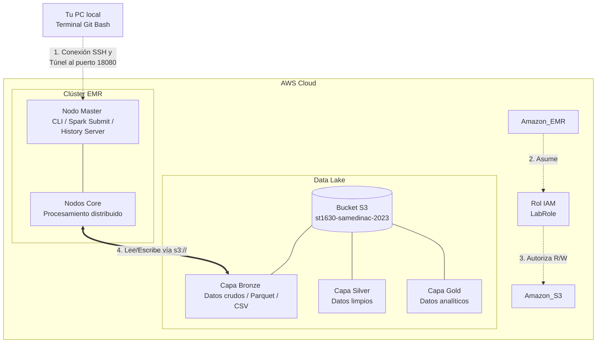

# Arquitectura — Lab 1a

**Curso:** ST1630-2026-2 · **Semana:** S4-S5 · **Fecha de entrega:** 23/08/2026
**Estudiante:** Sebastian Andres Medina Cabezas samedinac@eafit.edu.co

## 1. Diagrama de la arquitectura

## 2. Decisiones de S3

| Decisión | Tu elección | Justificación |
|---|---|---|
| Nombre del bucket | st1630-samedinac-2023 | Convención del curso: prefijo institucional + usuario + año. Globalmente único. |
| Región | us-east-1 | Región predeterminada de AWS Academy; menor latencia desde el entorno del Learner Lab. |
| Estructura de prefijos | bronze/, silver/, gold/ | Arquitectura medallion: separación clara entre datos crudos, limpios y agregados. |

**Justificación del particionamiento** 

> → Se utilizó Bronze/Silver/Gold porque permite separar claramente cada etapa del procesamiento de datos. Para este laboratorio, con solo 10.000 registros, no fue necesario agregar particiones por fecha o región. En un escenario de producción con mayor volumen sí consideraría particionar por fecha y, dependiendo de las consultas, por región.

## 3. Decisiones de IAM

- ¿Qué permisos otorgaste al rol de EMR, exactamente?

  → Inicialmente se suponia que se crearia un rol personalizado con s3:GetObject, s3:PutObject y s3:DeleteObject sobre los objetos de mi bucket, además de s3:ListBucket sobre el bucket. Sin embargo, el AWS Academy bloqueó iam:CreateRole, por lo que no fue posible aplicar ese rol. Se reutilizó EMR_EC2_DefaultRole, cuyo acceso a S3 fue verificado con simulate-principal-policy, obteniendo allowed para GetObject y PutObject sobre mi bucket.

- ¿Qué permisos consideraste y descartaste? ¿Por qué?

  → Se descartó otorgar s3:* con Resource: "*" porque daría al clúster permiso de leer, escribir y borrar objetos en cualquier bucket accesible de la cuenta. Las únicas acciones que EMR realmente necesita para este lab son: s3:GetObject (leer datos de bronze), s3:PutObject (escribir resultados en silver/gold), s3:DeleteObject (sobrescribir archivos en reejecutar el pipeline) y s3:ListBucket (descubrir qué archivos existen). Todo lo demás (s3:DeleteBucket, s3:CreateBucket, s3:PutBucketPolicy, etc.) es innecesario y peligroso.

- ¿Por qué importa el mínimo privilegio específicamente en un sistema
  **distribuido** como este (no solo "es buena práctica")? Conecta con
  el Teorema CAP: un agente/rol con acceso excesivo es, en cierto
  sentido, un riesgo análogo al de un nodo que retorna datos
  inconsistentes — ambos rompen una garantía que el resto del sistema
  asume que se sostiene.

  → En un sistema distribuido como EMR tenemos un montón de computadores (nodos) trabajando al mismo tiempo. Si a todos les damos permisos ilimitados, el riesgo se multiplica; si un solo nodo hace algo mal por un error en el código, podría borrar o dañar los datos de todo el datalake. Viéndolo desde el Teorema CAP, nosotros confiamos en que nuestros datos mantienen la consistencia (la "C" de CAP). Si un rol tiene permisos de sobra y por accidente sobreescribe información donde no debía, esa consistencia se rompe por completo. Es prácticamente lo mismo que tener un nodo dañado pasándole datos falsos al sistema: dejas de confiar en la información y todo el proceso pierde sentido.

## 4. Decisiones de EMR

- Tipo de instancia elegido y justificación (¿por qué es "mínimo
  viable" para este ejercicio, y qué cambiarías para producción?):

  → Se utilizaron 2 instancias m5.xlarge, una como nodo master y otra como core, por ser el mínimo viable económico y funcional para procesar cargas ligeras (10,000 registros). Para producción, se migraría a instancias optimizadas para memoria (familia r5) con Auto Scaling activo para escalar dinámicamente según la concurrencia y el volumen de datos.

- Configuración de Spark/aplicaciones instaladas:

  → Se instaló el ecosistema base con Hadoop (YARN), Spark y librerías de gestión de contenedores interactivos. Esta selección preconfigura de forma nativa los conectores hadoop-aws, permitiendo que Spark traduzca las consultas de datos directamente al almacenamiento de S3 sin requerir dependencias externas adicionales.

## 5. Estimación de costo

| Escenario | Costo estimado |
|---|---|
| Clúster encendido 24/7 durante un mes | → Aproximadamente USD 350.40/mes (0.48 × 730 h), más EBS y S3 |
| Clúster encendido solo durante las ~3 horas que lo usaste para el lab | → Aproximadamente USD 1.44 (0.48 × 3 h), más EBS y S3 |

## 6. Reflexión — la era agéntica

¿En qué decisión de este lab dudaste más? ¿Qué le consultaste a un
agente de IA y qué terminaste decidiendo por tu cuenta?

>La mayor duda surgió al intentar configurar la interfaz de EMR Studio, ya que la consola generaba un error de permisos en la API de EMR Serverless debido a las restricciones de la cuenta académica. Le consulté a la IA alternativas para levantar el entorno gráfico, y tras evaluar que los permisos de administración requeridos estaban bloqueados a nivel de cuenta, decidí por mi cuenta descartar EMR Studio y resolver la entrega ejecutando el código directamente mediante comandos spark-submit vía SSH.

## 7. Bitácora de delegación

| Tarea | ¿Delegado a agente? | Justificación |
|---|---|---|
| Boilerplate de SparkSession / lectura de S3 | → No | El codigo ya estaba en el notebook; yo solo edite la variable bucket. |
| Diseño de la consulta del benchmark (Celda 3) | → No | La consulta ya estaba implementada en el notebook |
| Creación del clúster EMR y configuración de IAM | → Sí | Se consultó a la IA para interpretar los bloqueos de permisos en el Learner Lab y poder configurar el IAM con los roles existentes que provee el Learner Lab. |
| Troubleshooting de errores de conexion a S3 | → Sí | Se utilizó IA para identificar y solucionar problemas de configuración de AWS CLI, IAM, EMR, roles, EMR Studio y conexión del clúster, más que todo porque no pude usar EMR studio, entonces la IA me ayudo a implementarlo con SSH |
| Pivotar de EMR Studio a conexión SSH | → Sí | Ante el bloqueo de la API de EMR Serverless en la cuenta académica, la IA me guió para levantar el túnel SSH al puerto 18080 y extraer la evidencia del Spark History Server. |
| Interpretación de los resultados y métricas | → Parcial | Utilicé la IA como apoyo para estructurar y dar formato a los outputs, pero las conclusiones se basaron en la ejecución real. |

