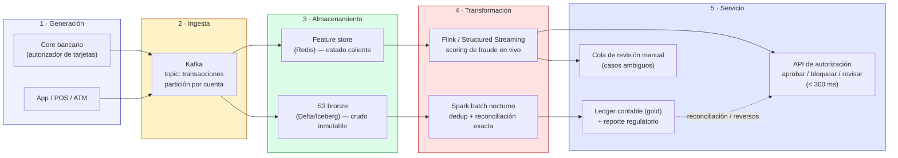

# Arquitectura de referencia — Caso 1: Fraude bancario

**Equipo:** Hellen Yanes Doria y Samuel Samper Cardona
**Curso:** ST1630 · Sistemas Intensivos en Datos · Semana 2
**Caso asignado:** Detección de fraude en pagos

## 1. Requisitos → 4 ejes (con números del enunciado)

| Eje | Requisito del caso | Lectura arquitectónica |
|---|---|---|
| **Latencia** | Decisión de aprobar/bloquear en **< 300 ms** | Descarta cualquier ruta que dependa de una consulta batch o de un lake completo; la decisión debe resolverse en memoria, cerca del evento |
| **Throughput** | **80.000 tx/s** en pico | Exige partición horizontal (no cabe en una sola instancia); el bus de ingesta debe soportar paralelismo masivo |
| **Consistencia** | **Conciliación contable exacta a fin de día** | El *ledger* final no puede ser aproximado: se necesita una fuente de verdad con garantías ACID, aunque la decisión operativa en caliente sea aproximada |
| **Costo / operación** | **Regulación estricta** (auditoría, trazabilidad, explicabilidad) | El costo relevante no es solo cómputo: es el costo de mantener dos lógicas de negocio sincronizadas en un entorno auditado. Cada pipeline adicional es superficie de auditoría adicional |

## 2. Patrón elegido: **Híbrido (streaming Kappa-like + Lakehouse batch)**

Ni Lambda pura ni Kappa pura ni Lakehouse-solo-batch cubren los cuatro ejes simultáneamente:

- **Lambda pura** duplicaría la lógica de scoring de fraude en batch y en streaming — inaceptable en un entorno con regulación estricta (dos lugares donde un bug de negocio puede divergir).
- **Kappa pura** (reprocesar todo el log para la verdad contable) no da la exactitud auditable que exige un cierre contable regulado sin pagar un reprocesamiento carísimo cada vez.
- **Lakehouse-solo-batch** no puede cumplir los 300 ms.

La solución que sí cubre los cuatro ejes es una **arquitectura híbrida por subsistema** — exactamente el insight de la pregunta de discusión de la sesión (slide 11): los ejes se reparten entre subsistemas, no se resuelven con un solo patrón.

- **Subsistema operativo (tiempo real):** streaming puro, estilo Kappa — un único log (Kafka) alimenta el *scoring* en caliente. Optimiza **latencia** y **throughput**.
- **Subsistema de verdad contable (batch):** Lakehouse / medallion sobre el mismo log. Optimiza **consistencia** y **auditoría/costo operativo**, porque batch y streaming leen del mismo Kafka — no hay dos copias de la lógica de negocio, solo dos velocidades de resolución.

## 3. Diagrama de arquitectura (ciclo de vida instanciado)

**Corriente subterránea crítica:** seguridad y gobernanza de datos — cada evento en Kafka lleva un `trace_id` propagado hasta el ledger, requisito no negociable para la auditoría regulatoria.

## 4. Mapeo etapa → tecnología → justificación por ejes

| Etapa | Tecnología | Justificación (eje) |
|---|---|---|
| 1 · Generación | Core bancario / autorizador de tarjetas emite evento por transacción | Fuente natural del dato; sin esto no hay ejes que discutir |
| 2 · Ingesta | Kafka, partición por cuenta/tarjeta | **Throughput**: partición horizontal es la única forma de sostener 80.000 tx/s sin un único cuello de botella |
| 3 · Almacenamiento | Redis (estado caliente, features de las últimas N transacciones) + S3 bronze en Delta/Iceberg | **Latencia**: Redis resuelve lecturas de features en microsegundos, imposible contra un lake. **Consistencia/auditoría**: Delta/Iceberg da ACID e inmutabilidad para el rastro contable |
| 4 · Transformación | Flink (scoring en vivo) + Spark batch nocturno (reconciliación) | **Latencia**: Flink calcula el score sin esperar ventanas largas. **Consistencia**: el job batch nocturno es el que certifica el número final, tolerando ser lento porque el corte contable no tiene el límite de 300 ms |
| 5 · Servicio | API de autorización (bloqueo en caliente) + ledger gold + cola de revisión manual | **Latencia**: la API responde en el presupuesto de 300 ms. **Costo/operación**: los casos ambiguos van a revisión humana en vez de sobre-diseñar un modelo perfecto — regla de oro del taller |

## 5. Bitácora de delegación (uso de IA)

| Tarea | ¿Quién la hizo? |
|---|---|
| Extracción de los 4 ejes desde el enunciado del caso | Equipo (manual) |
| Elección del patrón (híbrido) y el ADR | Equipo (manual) |
| Generación del código Mermaid del diagrama ya diseñado en papel por el equipo | Asistido por IA |
| Formateo y redacción final de este documento | Asistido por IA |
| Revisión cruzada del PR de otro equipo | Pendiente — se hace manualmente en el PR |

Ver el detalle de la decisión más difícil de este diseño en [`adr.md`](./adr.md).
