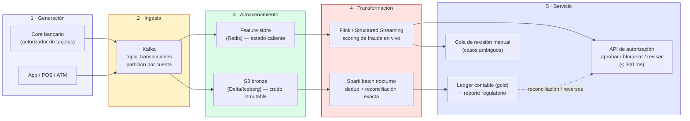

# Diagrama de arquitectura — Caso 1: Fraude bancario

**Equipo:** Hellen Yanes Doria y Samuel Samper Cardona
**Patrón:** Híbrido (streaming Kappa-like para la decisión en tiempo real + Lakehouse batch para el ledger contable exacto)

## Lectura del diagrama

| Etapa | Tecnología | Por qué |
|---|---|---|
| 1 · Generación | Core bancario / autorizador de tarjetas, app, POS, ATM | Fuente del evento de transacción |
| 2 · Ingesta | Kafka, partición por cuenta/tarjeta | Sostiene 80.000 tx/s sin cuello de botella (throughput) |
| 3 · Almacenamiento | Redis (estado caliente) + S3 bronze en Delta/Iceberg | Redis resuelve features en microsegundos (latencia); Delta/Iceberg da ACID para el rastro contable (consistencia/auditoría) |
| 4 · Transformación | Flink (scoring en vivo) + Spark batch nocturno | Flink no espera ventanas largas (latencia); el batch certifica el número final (consistencia) |
| 5 · Servicio | API de autorización + ledger gold + cola de revisión manual | La API responde en el presupuesto de 300 ms; los casos ambiguos van a revisión humana en vez de sobre-diseñar |

**Corriente subterránea crítica:** seguridad y gobernanza — cada evento lleva un `trace_id` propagado hasta el ledger, para la auditoría regulatoria.

La flecha punteada (ledger → API) representa el proceso de **reconciliación y reversión**: cuando el batch nocturno certifica una discrepancia frente a lo decidido en caliente, se dispara un contracargo — ver el detalle en [`adr.md`](./adr.md).

El mapeo completo por ejes (latencia, throughput, consistencia, costo) está en [`arquitectura.md`](./arquitectura.md).
