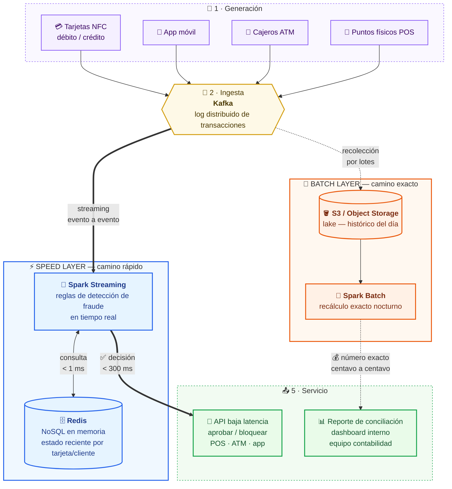

# Diagrama de arquitectura — Equipo Andres Velez - Sebastian Salazar · Caso 1 (Fraude bancario)

Arquitectura **Lambda**: dos caminos (speed layer + batch layer) que
convergen en la capa de servicio.

**Leyenda visual:**
- Flecha gruesa (`==>`) = camino **caliente**, tiempo real.
- Flecha punteada (`-.->`) = camino **frío**, procesamiento por lotes.
- Morado = Generación · Amarillo = Ingesta · Azul = Speed layer · Naranja = Batch layer · Verde = Servicio.

**Lectura del diagrama:**
- El *speed layer* (azul) resuelve la decisión de bloqueo/aprobación en
  tiempo real, consultando estado reciente en Redis.
- El *batch layer* (naranja) relee el lake al final del día y calcula
  el número de conciliación exacto, sin presión de tiempo.
- Ambos caminos comparten la misma fuente (Kafka) pero corren lógica
  separada — ese es el "precio de Lambda" discutido en el ADR.
